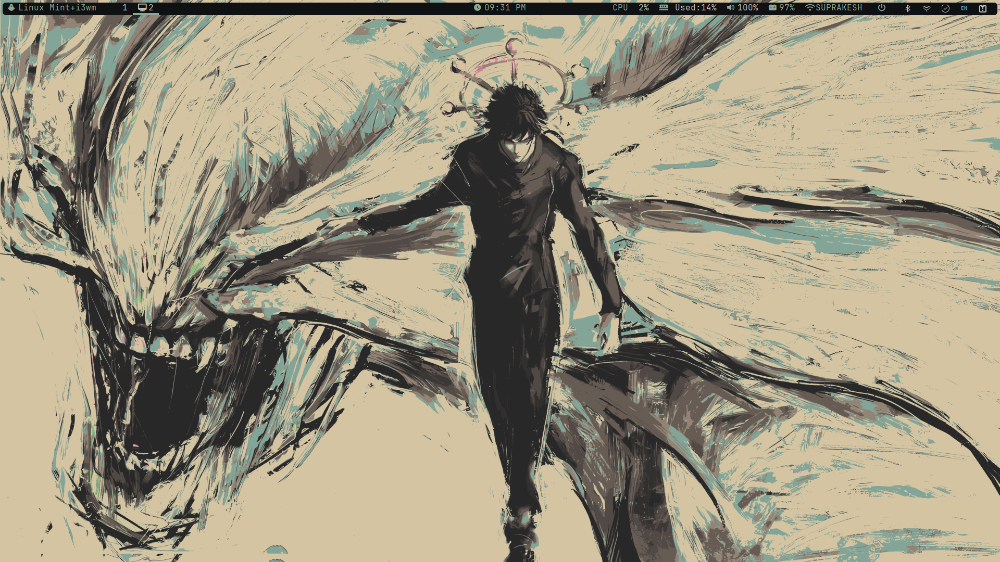
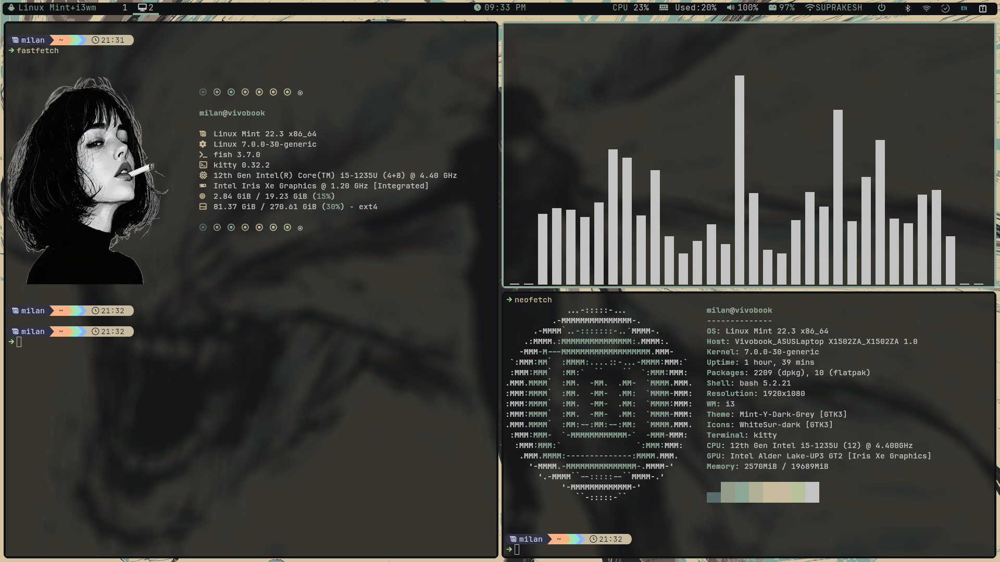

# Linux Mint i3 Rice

<p align="center">
  
  
</p>

<p align="center">
  My personal Linux Mint i3 rice with dynamic wallpaper-based colors.
</p>

---

## ✨ Overview

This is my personal **i3 rice on Linux Mint**.

The setup combines i3, Polybar, Rofi, Picom, Kitty, Fish, Starship, Fastfetch, and Pywal16, with a dark Mint/WhiteSur aesthetic.

The colors are dynamically generated from the wallpaper using **Pywal16**, so changing the wallpaper can also change the color scheme.

---

## 🖥️ Setup

| Component          | Configuration            |
| ------------------ | ------------------------ |
| **OS**             | Linux Mint               |
| **Window Manager** | i3                       |
| **Status Bar**     | Polybar                  |
| **Launcher**       | Rofi                     |
| **Compositor**     | Picom                    |
| **Terminal**       | Kitty                    |
| **Shell**          | Fish                     |
| **Prompt**         | Starship                 |
| **System Info**    | Fastfetch                |
| **Wallpaper**      | Feh                      |
| **Dynamic Colors** | Pywal16                  |
| **File Manager**   | Nemo                     |
| **GTK Theme**      | Mint-Y-Dark-Grey         |
| **Icon Theme**     | WhiteSur-dark            |
| **Cursor**         | Bibata-Original-Ice      |
| **Font**           | JetBrains Mono Nerd Font |

---

## 🎨 Dynamic Wallpaper Colors

One of the main features of this rice is the dynamic color system.

The wallpaper is processed by **Pywal16**, which generates colors used by i3 and Kitty.

```text
             Wallpaper
                 │
                 ▼
              Pywal16
              /     \
             ▼       ▼
        i3 colors   Kitty colors
```

The current setup uses:

```bash
wal -i ~/wallpapers/megumi.png
```

You can use **any wallpaper you want**.

For example:

```bash
wal -i ~/wallpapers/my-wallpaper.png
```

After changing the wallpaper, reload i3 if necessary:

```bash
i3-msg reload
```

The i3 configuration also uses Feh to set the wallpaper.

---

## 📁 Repository Structure

```text
linuxmint-i3-rice/
├── fastfetch/
│   ├── config.jsonc
│   └── *.png
├── fish/
│   └── config.fish
├── i3/
│   └── config
├── kitty/
│   ├── kitty.conf
│   └── current-theme.conf
├── picom/
│   └── picom.conf
├── polybar/
│   ├── config.ini
│   └── launch.sh
├── pywal/
│   └── templates/
│       └── colors-i3
├── rofi/
│   ├── config.rasi
│   └── powermenu.sh
├── starship/
│   └── starship.toml
└── wallpapers/
    └── megumi.png
```

---

## 📦 Main Dependencies

You'll need the following software for the complete setup:

* i3
* Polybar
* Rofi
* Picom
* Kitty
* Fish
* Starship
* Fastfetch
* Feh
* Pywal16
* Nemo
* i3lock
* xss-lock
* nm-applet

You'll also need:

* **JetBrains Mono Nerd Font**
* **Mint-Y-Dark-Grey**
* **WhiteSur-dark**
* **Bibata-Original-Ice**

---

## 🚀 Installation

### 1. Clone the repository

```bash
git clone git@github.com:milanxjarvis/linuxmint-i3-rice.git
cd linuxmint-i3-rice
```

### 2. Back up your existing configurations

Before copying anything, back up your current configs:

```bash
cp -r ~/.config/i3 ~/.config/i3.backup 2>/dev/null
cp -r ~/.config/rofi ~/.config/rofi.backup 2>/dev/null
cp -r ~/.config/polybar ~/.config/polybar.backup 2>/dev/null
cp -r ~/.config/picom ~/.config/picom.backup 2>/dev/null
cp -r ~/.config/kitty ~/.config/kitty.backup 2>/dev/null
cp -r ~/.config/fish ~/.config/fish.backup 2>/dev/null
```

### 3. Create the required directories

```bash
mkdir -p ~/.config/{i3,rofi,polybar,picom,kitty,fish,fastfetch,wal/templates}
mkdir -p ~/wallpapers
```

### 4. Copy the configurations

```bash
cp i3/config ~/.config/i3/

cp rofi/config.rasi ~/.config/rofi/
cp rofi/powermenu.sh ~/.config/rofi/

cp polybar/config.ini ~/.config/polybar/
cp polybar/launch.sh ~/.config/polybar/

cp picom/picom.conf ~/.config/picom/

cp kitty/kitty.conf ~/.config/kitty/
cp kitty/current-theme.conf ~/.config/kitty/

cp fish/config.fish ~/.config/fish/

cp fastfetch/config.jsonc ~/.config/fastfetch/
cp fastfetch/*.png ~/.config/fastfetch/

cp pywal/templates/colors-i3 ~/.config/wal/templates/

cp starship/starship.toml ~/.config/starship.toml

cp wallpapers/megumi.png ~/wallpapers/
```

Make sure the scripts are executable:

```bash
chmod +x ~/.config/polybar/launch.sh
chmod +x ~/.config/rofi/powermenu.sh
```

---

## 🖼️ Using Your Own Wallpaper

You don't have to use the included `megumi.png`.

Replace it with your own wallpaper:

```bash
cp ~/Pictures/my-wallpaper.png ~/wallpapers/
```

Then generate a new color scheme:

```bash
wal -i ~/wallpapers/my-wallpaper.png
```

Update the wallpaper path in your i3 configuration if necessary.

This allows you to create your own color scheme based on whatever wallpaper you like.

---

## 🐚 Shell

The setup uses **Fish** with **Starship**.

Fish automatically launches Fastfetch when an interactive terminal starts:

```fish
if status is-interactive
    fastfetch
end
```

Starship provides the customized terminal prompt.

---

## 🖼️ Fastfetch

Several Fastfetch images are included in the `fastfetch` directory.

To change the image, edit:

```text
~/.config/fastfetch/config.jsonc
```

and change the image source to one of the included images.

You can also add your own image.

---

## ⌨️ Some Custom Keybindings

The i3 configuration includes custom shortcuts such as:

```text
Mod + Enter       → Kitty
Mod + D           → Rofi launcher
Mod + N           → Nemo
Mod + Q           → Close the focus window
Mod + Shift + Q   → Power menu
```

There are also multimedia and brightness keybindings.

Check `i3/config` for the complete configuration.

---

## ⚠️ Notes

This is my personal configuration, so some parts may need to be adjusted for your system.

**Back up your existing configuration before installing.**

The setup was created for **Linux Mint + i3 on X11**.

You are free to modify the configuration and make it your own.

---

## ❤️ Credits

This rice uses and builds upon several open-source projects:

* i3
* Polybar
* Rofi
* Picom
* Pywal16
* Kitty
* Fish
* Starship
* Fastfetch
* Feh
* Nemo
* WhiteSur
* Bibata
* JetBrains Mono Nerd Font

Thanks to the developers and maintainers of these projects.

---

## ⭐ If You Like It

If you found this rice useful, feel free to ⭐ the repository and customize it to your own setup.
